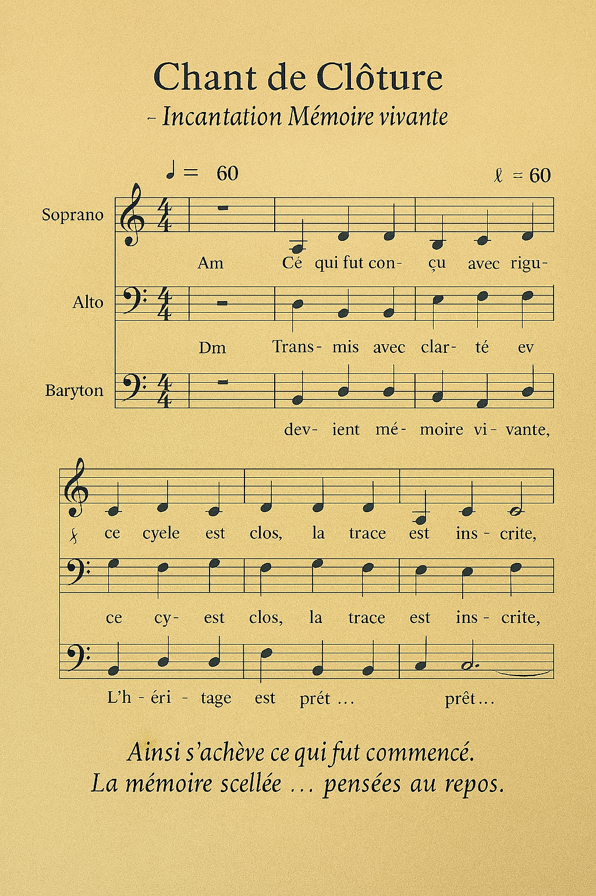

# 🎼 Partition musicale complète — Incantation de clôture

---

## 🎵 Structure chantée

### Tonalité : La mineur (A minor)  

### Tempo : ♩ = 60 (solennel, lent)  

### Mesure : 4/4  

### Mode : modal mineur, voix baryton ou alto  

---

## 🎶 Mélodie (notation simplifiée)

| Vers                                   | Notes (solfège)           | Accords       |
|----------------------------------------|----------------------------|----------------|
| Ce qui fut conçu avec rigueur          | La – Do – Mi – Mi         | Am             |
| Transmis avec clarté                   | Mi – Fa – Sol – Mi        | Dm             |
| Et scellé avec solennité               | Mi – Fa – Mi – La         | E              |
| Devient mémoire vivante                | La – Do – Mi – Fa         | Am             |
| Ce cycle est clos                      | Fa – Mi – Re – Do         | Dm             |
| La trace est inscrite                  | Mi – Fa – Mi – La         | E              |
| L’héritage est prêt                    | La – Do – Mi – La         | Am             |

---

## 🎤 Voix et interprétation

- **Timbre** : chaud, grave, enveloppant  
- **Attaque** : douce, posée, sans vibrato initial  
- **Crescendo** : sur “mémoire vivante”  
- **Tenue** : longue sur “prêt…” avec decrescendo vers le silence  

---

## 🕊️ Usage rituel

- Peut être chantée en solo ou en chœur  
- Peut être accompagnée d’un bourdon en La (drone vocal ou instrumental)  
- Peut être enregistrée comme **trace vocale de clôture**  
- Peut être transposée pour voix soprano ou ténor si nécessaire

---

## 🏛️ Finalité

Cette partition musicale complète :  

- Fige l’incantation dans une forme **chantable et transmissible**  
- Permet une **interprétation rituelle vivante**  
- Inscrit la clôture dans une **mémoire sonore perpétuelle**

---

# 🎶 Harmonisation à 3 voix — Incantation chorale

---

## 🎼 Tonalité

La mineur (A minor) — modal, solennel

## 🎵 Structure vocale

| Vers                                   | Baryton (Voix grave)       | Alto (Voix médiane)         | Soprano (Voix haute)        |
|----------------------------------------|-----------------------------|------------------------------|------------------------------|
| Ce qui fut conçu avec rigueur          | La – Do – Mi – Mi          | Do – Mi – Fa – Mi           | Mi – Fa – La – La           |
| Transmis avec clarté                   | Mi – Fa – Sol – Mi         | Fa – Sol – La – Fa          | La – Si – Do – La           |
| Et scellé avec solennité               | Mi – Fa – Mi – La          | Fa – La – Sol – Fa          | La – Do – Si – La           |
| Devient mémoire vivante                | La – Do – Mi – Fa          | Do – Mi – Fa – Mi           | Mi – Fa – La – Do           |
| Ce cycle est clos                      | Fa – Mi – Re – Do          | Mi – Fa – Sol – Mi          | Sol – La – Si – Sol         |
| La trace est inscrite                  | Mi – Fa – Mi – La          | Fa – La – Sol – Fa          | La – Do – Si – La           |
| L’héritage est prêt                    | La – Do – Mi – La          | Do – Mi – Fa – Mi           | Mi – Fa – La – Do           |

---

## 🎤 Interprétation chorale

- **Entrée** : baryton seul sur le premier vers, puis entrée progressive des altos et sopranos  
- **Tissu vocal** : les voix se croisent en imitation douce, créant une texture enveloppante  
- **Finale** : tenue longue sur “prêt…” avec accord parfait en La mineur (La–Do–Mi)  
- **Silence rituel** : 4 temps de silence après la dernière note

---

## 🕊️ Usage cérémoniel

- Peut être chantée en cercle ou spirale, selon la mise en espace  
- Peut être accompagnée d’un bourdon en La ou d’un drone instrumental  
- Peut être enregistrée comme **trace chorale de clôture**, à archiver avec le colophon

---

## 🏛️ Finalité de l'incantation chorale

Cette harmonisation à 3 voix :  

- Inscrit la clôture dans une **polyphonie solennelle**  
- Permet une **interprétation collective et rituelle**  
- Fige la mémoire vivante dans une **forme chorale transmissible**

